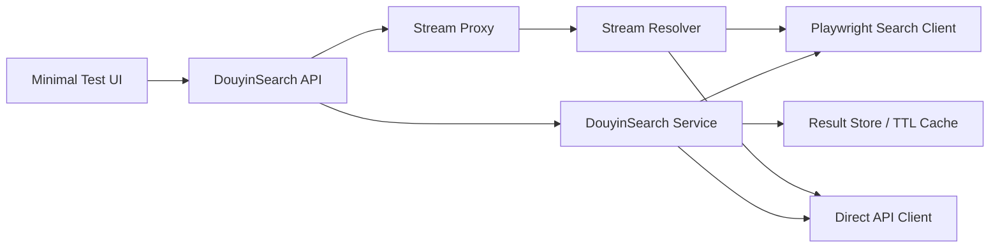

# Module Architecture

## High-Level Shape



## Boundary

This module owns only Douyin search and preview streaming.

The module does not know about projects, timelines, render jobs, or future modules. Later integration should call this module through its API or import its service layer.

## Components

### DouyinSearch API

FastAPI routes for:

- health/session checks
- search
- result metadata
- video stream proxy
- cookie diagnostics

### DouyinSearch Service

Coordinates the search strategies and returns normalized results.

Decision flow:

1. Validate input.
2. Optionally translate keyword.
3. Try direct API if enabled.
4. Use Playwright browser search when direct API is disabled or fails.
5. Normalize results.
6. Store short-lived result records.
7. Return streamable response.

### Playwright Search Client

Owns browser context, cookie loading, page navigation, search input automation, response capture, and DOM fallback parsing.

### Direct API Client

Optional fast path for Douyin web API. It can search when cookies/signatures are valid, but it must not be required for the module to work.

### Stream Proxy

The frontend never plays raw Douyin media URLs directly. It plays module-owned URLs:

```text
/api/douyin/results/{result_id}/stream
```

The proxy attaches headers/cookies when needed and supports HTTP Range requests.

### Result Store

V1 can use in-memory TTL cache. The cache maps `result_id` to normalized result metadata and the latest resolved stream handle.

Later, this can move to SQLite if persistence is needed.

## Suggested Package Layout

```text
app/
  main.py
  api/
    douyin.py
  douyinsearch/
    __init__.py
    service.py
    schemas.py
    errors.py
    cookies.py
    browser_client.py
    direct_api_client.py
    parser.py
    stream_proxy.py
    result_store.py
  static/
    index.html
    app.js
    style.css
docs/
```

## Runtime Dependencies

- Python 3.11+
- FastAPI
- Uvicorn
- HTTPX
- Playwright
- Chromium installed through Playwright

## Configuration

```env
DOUYIN_COOKIE_FILE=./secrets/douyin-cookies.json
DOUYIN_BROWSER_HEADLESS=true
DOUYIN_BROWSER_PROFILE_DIR=./storage/browser/douyin
DOUYIN_USE_DIRECT_API=false
DOUYIN_RESULT_TTL_SECONDS=1800
```
