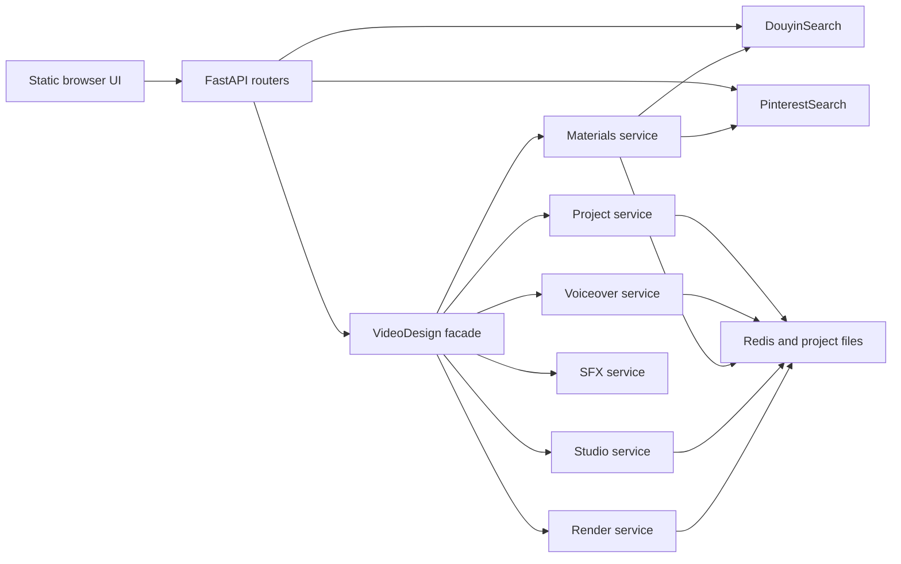

# Application Architecture

## High-Level Shape



The application contains three product modules. DouyinSearch and PinterestSearch own source
discovery and stream/proxy behavior. VideoDesign coordinates project creation, voiceover,
material selection, Studio timeline editing, preview, and export.

## HTTP Boundary

`app/main.py` mounts three routers:

- `/api/douyin/*` for Douyin health, search, result metadata, cover, and stream access;
- `/api/pinterest/*` for Pinterest health, search, media proxy, and download access;
- `/api/videodesign/*` for the production workflow and Studio.

The static pages are served at `/`, `/pinterestsearch`, and `/videodesign`. API route shapes
are protected by a characterization test.

## Search Modules

Each search module owns its browser session, cookie loading, source parser, normalized
results, and short-lived result store. Douyin uses a persistent Playwright context as its
working path. Pinterest provides equivalent source-owned search and media resolution.

VideoDesign consumes normalized search results through these service boundaries. It does
not duplicate browser automation in the Materials domain.

## VideoDesign Backend

`VideoDesignService` remains the compatibility object imported by the API. It constructs
shared dependencies and delegates to domain services:

```text
app/videodesign/
  service.py                    compatibility facade
  project_service.py            project, script, planning, scenes
  voiceover_service.py          TTS, global voiceover, timing
  project_state.py              shared project selectors and invalidation
  materials/
    search_plan.py              search groups and keyword normalization
    candidates.py               candidate and source mapping
    proxy.py                    local preview proxies
    service.py                  search, review, approval, download, prune
  studio/
    service.py                  timeline and editor state mutations
    render.py                   FFmpeg preview and export
    sfx.py                      catalog, event suggestions, timeline SFX
```

The facade preserves selected helper and dependency patch points while old tests and callers
still depend on them. New domain behavior belongs in the owning service, not in the facade.

## VideoDesign Frontend

The frontend uses native browser ES modules and has no bundler:

```text
app/static/videodesign.js       module entrypoint
app/static/videodesign/
  main.js                       bootstrap
  workflow.js                   top-level flow and render orchestration
  state.js                      shared application state
  api.js                        HTTP and progress helpers
  ui.js                         shared UI state
  utils.js                      pure helpers
  project.js                    project, script, template, and TTS views
  materials.js                  search groups, candidates, and approval
  studio/
    index.js                    Studio coordinator
    audio.js                    voice, music, and SFX controls
    panels.js                   Studio inspectors
    playback.js                 synchronized preview playback
    stage.js                    video stage and draggable overlays
    timeline.js                 ruler, clips, playhead, drag, and resize
```

Dependency direction is entrypoint to workflow, workflow to feature modules, and feature
modules to shared state/API/utilities. Shared modules do not import feature modules.

## Persistence And Media

`VideoDesignStore` keeps project state in Redis when configured and retains project-owned
files under the storage directory. Existing JSON/Redis payloads are loaded without a manual
migration. Downloaded source media and generated proxies, TTS, music, previews, and exports
remain project-owned files.

yt-dlp handles source downloads where possible. FFmpeg creates preview proxies, combines
voice/music/SFX, applies timeline transforms and transitions, and renders preview/export
files.

## Compatibility Rules

1. Keep API paths and response shapes stable during extraction work.
2. Keep persisted project and timeline models backward compatible.
3. Keep global voiceover as the source of truth for scene timing.
4. Keep search/browser concerns inside the source modules.
5. Keep timeline mutation separate from expensive rendering.
6. Add behavior to the owning domain module rather than growing the facade again.
