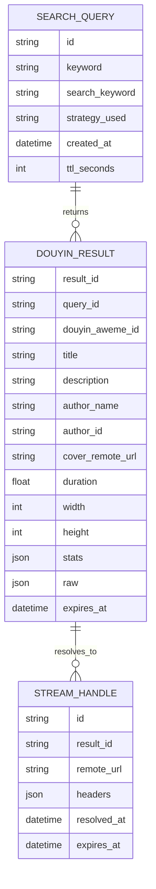

# Data Model

## Overview

The module only needs short-lived search data. V1 can use in-memory TTL storage.



## Search Query

Represents one search request.

- `id`: internal query ID.
- `keyword`: original user keyword.
- `search_keyword`: translated or final keyword sent to Douyin.
- `strategy_used`: `browser` or `direct_api`.
- `created_at`
- `ttl_seconds`

## Douyin Result

Normalized video result.

- `result_id`: module result ID.
- `douyin_aweme_id`: platform video ID.
- `title`
- `description`
- `author_name`
- `author_id`
- `cover_remote_url`
- `duration`
- `width`
- `height`
- `stats`
- `raw`: source-specific data kept for debugging and stream resolution.
- `expires_at`: result cache expiry.

## Stream Handle

Resolved playable video reference.

- `remote_url`: current Douyin media URL or play API URL.
- `headers`: request headers needed to fetch media.
- `resolved_at`
- `expires_at`

The frontend should never store or depend on `remote_url`. It should use:

```text
/api/douyin/results/{result_id}/stream
/api/douyin/results/{result_id}/download
```
