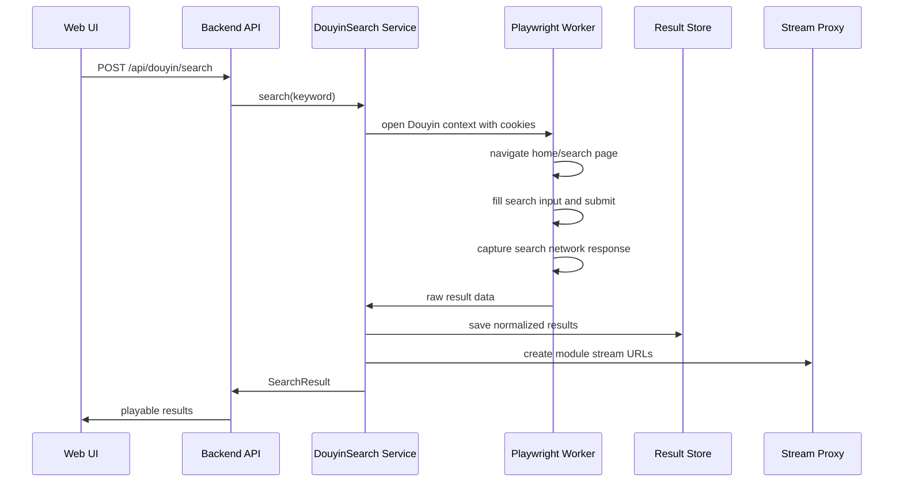

# Douyin Search Module

## Can Douyin API Search Work?

Yes, direct Douyin web API search can work in some cases. The endpoint pattern is usually similar to:

```text
https://www.douyin.com/aweme/v1/web/search/item/
```

However, this path is fragile. It often depends on valid cookies, browser-like headers, `msToken`, `a_bogus`, `X-Bogus`, web IDs, and current Douyin frontend behavior. Those fields can change. A direct API client is useful as an optimization, but it should not be the only implementation.

## Recommended Strategy

Use a two-layer adapter:

1. **Browser strategy:** Playwright with a real Douyin web session and cookies. This is the primary reliable workflow.
2. **Direct API strategy:** Optional fast path. Use only when signatures/cookies are valid. Fall back to browser strategy if it fails.

## Responsibilities

The `douyinsearch` module must:

- Load a browser context with Douyin cookies.
- Open Douyin with a realistic browser profile.
- Search a keyword.
- Capture search API responses when possible.
- Parse result cards as fallback.
- Resolve each result into a normalized Douyin result.
- Provide a module-owned stream URL through the Stream Proxy.
- Expose clear failure states: cookie expired, login required, captcha, no results, network error.

## Search Flow



## Browser Search Behavior

Preferred behavior:

1. Create or reuse a persistent Playwright context.
2. Add cookies from configured cookie storage.
3. Navigate to `https://www.douyin.com`.
4. Detect login state.
5. Find the search input.
6. Fill keyword and press Enter.
7. Switch to video tab/filter when available.
8. Wait for either:
   - response URL containing `/aweme/v1/web/search/item/`
   - visible video result cards
9. Extract structured results.
10. Resolve missing stream URLs per result if needed.

Fallback behavior:

- Navigate directly to `https://www.douyin.com/search/{keyword}?type=video`.
- Scrape result card links.
- Resolve each aweme ID by opening detail page or using the direct API strategy.

## Cookie Management

Cookie storage must support:

- Plain cookie header string.
- Playwright storage state JSON.
- Browser-exported cookie JSON.

Recommended config:

```env
DOUYIN_COOKIE_FILE=./secrets/douyin-cookies.json
DOUYIN_BROWSER_HEADLESS=true
DOUYIN_BROWSER_PROFILE_DIR=./storage/browser/douyin
```

The adapter should validate cookies before searching:

- Visit Douyin home.
- Check if logged-in-only UI exists.
- Detect captcha or verification page.
- Return `COOKIE_EXPIRED` or `CHALLENGE_REQUIRED` instead of silently returning no results.

## Result Shape

Each Douyin result becomes a normalized module result:

```json
{
  "result_id": "dyr_01J...",
  "douyin_aweme_id": "7350000000000000000",
  "title": "Video caption",
  "author_name": "Author",
  "author_id": "sec_uid",
  "cover_url": "/api/douyin/results/dyr_01J.../cover",
  "stream_url": "/api/douyin/results/dyr_01J.../stream",
  "duration": 12.34,
  "width": 1080,
  "height": 1920,
  "stats": {
    "likes": 1000,
    "comments": 30,
    "shares": 20
  },
  "stream_state": "resolvable"
}
```

Do not expose raw Douyin `play_url` directly to the frontend as the primary playback URL. Register it in the module result store and return:

```text
/api/douyin/results/{result_id}/stream
```

## Direct API Path

Direct API search can be implemented as:

```text
DouyinDirectSearchClient.search(keyword, cursor, count)
```

It should:

- Use cookies and browser headers.
- Generate or obtain required signatures.
- Return typed errors.
- Never be the only path.

Failure cases that should trigger browser fallback:

- Non-200 response.
- JSON parse error.
- Douyin status error.
- Empty results with suspicious challenge/login response.
- Signature generation failure.

## Stream Path

Douyin media URLs often require headers. The browser should play through backend proxy:

```text
GET /api/douyin/results/{result_id}/stream
```

The Stream Proxy should:

- Resolve the latest source stream URL.
- Attach Douyin headers/cookies if needed.
- Support HTTP Range requests for video playback.
- Return `RESULT_EXPIRED` when the result is no longer in the module TTL cache.
