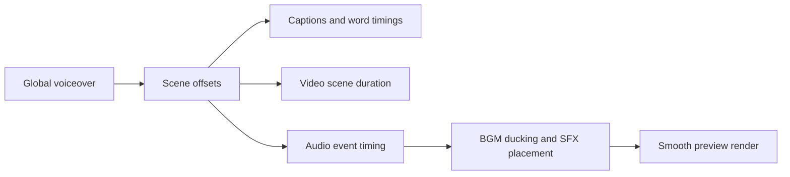

# Studio Audio, BGM, And Event-Driven SFX Flow

## Goal

Add a real audio system to VideoDesign Studio:

- keep global voiceover as the timeline source of truth
- add background music that can loop, trim, fade, and duck under voiceover
- add event-driven SFX generated from script/caption/transition/icon/timeline events
- let the user review, edit, mute, move, and delete audio events before render
- render BGM and SFX into smooth preview and future final export

This module does not change video duration. Audio layers follow the existing timeline.

## Current Context

Existing project already has:

- global voiceover generated as one continuous track
- scene offsets derived from voiceover duration
- timeline items for media, captions, text, icons, overlays, transitions, and voiceover
- smooth preview render using FFmpeg
- realtime Studio preview for editing plus rendered preview cache for quality playback

Missing:

- background music asset model
- SFX asset library
- audio timeline lanes for BGM and SFX
- event extraction from text/caption/transition/icon actions
- audio mix/render graph
- user review workflow for suggested SFX

## Core Principle

Voiceover remains the master timeline.



BGM and SFX must not stretch scenes or change caption timing.

## Audio Layers

### 1. Voiceover Layer

Existing locked layer:

- `voiceover_audio`
- one global audio file when available
- cannot be dragged in V1
- used for preview/render timing

### 2. Background Music Layer

New layer:

- `background_music`

Purpose:

- ambience, emotion, retention
- plays under the full video or selected ranges
- ducked under voiceover by default

Timeline item type:

```json
{
  "type": "music",
  "layer_id": "background_music",
  "start_seconds": 0,
  "end_seconds": 33.02,
  "source_ref": {
    "asset_id": "mus_x",
    "audio_url": "/api/videodesign/projects/{project_id}/audio/music/{asset_id}/file",
    "local_path": "...",
    "trim_start_seconds": 0,
    "loop": true
  },
  "style": {
    "volume": 0.18,
    "fade_in_seconds": 0.8,
    "fade_out_seconds": 1.2,
    "ducking": "light"
  }
}
```

Supported ducking presets:

- `none`: no ducking
- `light`: music lowered gently under voiceover
- `strong`: music stays clearly below narration

V1 can implement ducking as static lower BGM volume. Later versions can use FFmpeg `sidechaincompress`.

### 3. SFX Layer

New layer:

- `sfx`

Purpose:

- short sound accents tied to timeline events
- transition impacts/whooshes
- caption word pops
- icon/emphasis hits
- hook/opening risers

Timeline item type:

```json
{
  "type": "sfx",
  "layer_id": "sfx",
  "scene_id": "scn_x",
  "start_seconds": 12.42,
  "end_seconds": 12.9,
  "source_ref": {
    "asset_id": "sfx_pop_01",
    "audio_url": "/static/sfx/pop_01.mp3",
    "event_id": "evt_caption_word_12",
    "event_type": "caption_word",
    "label": "word pop"
  },
  "style": {
    "volume": 0.35,
    "fade_in_seconds": 0,
    "fade_out_seconds": 0.08,
    "pitch": 1,
    "enabled": true
  }
}
```

## Asset Library

### Music Assets

V1 sources:

- user upload
- local project folder

Storage:

```text
storage/videodesign/{project_id}/audio/music/{asset_id}.mp3
storage/videodesign/{project_id}/audio/music/{asset_id}.json
```

Metadata:

- `asset_id`
- `name`
- `local_path`
- `duration_seconds`
- `mood`
- `energy`
- `source`
- `created_at`

### SFX Assets

V1 should ship with a small built-in pack before supporting upload.

Suggested pack:

- `pop_soft`
- `pop_bright`
- `click_soft`
- `type_tick`
- `whoosh_short`
- `whoosh_rise`
- `impact_soft`
- `impact_deep`
- `ding`
- `sparkle`
- `camera_shutter`
- `glitch_tick`

Each SFX should be short, clean, and not too loud.

Metadata:

- `asset_id`
- `name`
- `category`
- `duration_seconds`
- `local_path` or `static_url`
- `default_volume`
- `recommended_events`

Categories:

- `caption`
- `transition`
- `icon`
- `hook`
- `emphasis`
- `ambient`

## Event-Driven SFX

### Event Extraction

Create an audio event planner that derives possible SFX events from timeline data.

Input:

- project script
- scene plans
- caption chunks
- timeline items
- transition items
- icon items
- text overlay items

Output:

```json
{
  "event_id": "evt_x",
  "scene_id": "scn_x",
  "event_type": "transition",
  "time_seconds": 7.34,
  "duration_hint_seconds": 0.35,
  "priority": 0.8,
  "label": "scene transition whoosh",
  "reason": "Fade transition between scene 2 and 3",
  "recommended_sfx": ["whoosh_short", "impact_soft"],
  "default_volume": 0.32
}
```

### Event Types

#### 1. Transition Events

Generated from every transition timeline item.

Timing:

- default at transition start
- impact variant can land near transition midpoint or end

Rules:

- `fade`, `dissolve`: soft whoosh or no SFX
- `slide_left`, `slide_right`, `slide_up`: whoosh
- `zoom_in`, `zoom_out`: rise or impact
- `flash_cut`: bright hit or camera shutter

Acceptance:

- user can apply one SFX to selected transition
- user can apply suggested transition SFX to all transitions

#### 2. Caption Word Events

Generated from active word timing.

V1 timing source:

- current caption chunks are approximate per scene
- split scene text into words
- distribute words across scene duration

Rules:

- do not add SFX to every word by default
- select important words only
- important words are:
  - first word of hook
  - all-caps words
  - numbers
  - short punch words
  - words after punctuation break
  - words selected manually by user

Default max:

- `0-2` caption SFX per scene
- global cap around `12` SFX per video

Reason:

- word-pop on every word becomes noisy and cheap quickly

#### 3. Text Overlay Events

Generated when a text timeline item appears.

Timing:

- item start time

Recommended SFX:

- `pop_soft`
- `type_tick`
- `ding`

Rules:

- if text overlay is empty or hidden, no event
- if text uses typewriter animation, use subtle ticks

#### 4. Icon Events

Generated when icon item appears.

Timing:

- icon item start time

Recommended SFX:

- arrow: `whoosh_short`
- circle/rectangle/underline: `click_soft` or `marker`
- starburst/exclamation: `impact_soft`
- check: `ding`
- question: `pop_soft`

#### 5. Hook Events

Generated at video start and strong scene starts.

Timing:

- `0.0s`
- selected high-priority scene starts

Recommended SFX:

- `impact_deep`
- `riser_short`
- `glitch_tick`

Rules:

- only one opening hook SFX by default
- avoid heavy impact if voiceover starts immediately unless volume is low

## Smart SFX Planner

### V1 Heuristic Planner

Start with deterministic rules. Do not call LLM yet.

Why:

- stable
- fast
- easy to debug
- no API cost

Algorithm:

1. collect transition events
2. collect icon start events
3. collect non-empty text overlay start events
4. collect caption emphasis events
5. add one hook event at 0.0s
6. sort by time
7. enforce spacing and caps
8. return suggestions for user review

Spacing rules:

- minimum `0.45s` between SFX events
- transition SFX wins over caption SFX
- icon SFX wins over caption SFX when time overlaps
- hook SFX wins at start

### V2 LLM Planner

Use DeepSeek later to improve selection, not timing.

LLM input:

- scene voiceover text
- visual brief
- transition type
- available event candidates
- SFX catalog

LLM output:

- which events deserve SFX
- recommended category
- intensity
- reason

LLM must not invent asset paths. It can only choose from catalog ids.

## User Review Workflow

Add Studio `Audio` tool with two tabs:

- `Music`
- `SFX`

### Music UI

Controls:

- upload music
- choose music asset
- play preview
- add to timeline
- volume slider
- ducking preset
- fade in/out
- loop to video duration
- delete music item

Timeline behavior:

- music item appears in `background_music`
- user can drag/resize item
- music item can be muted

### SFX UI

Controls:

- `Generate SFX suggestions`
- event list grouped by scene
- each row:
  - event type
  - time
  - recommended SFX
  - play SFX
  - add/skip
  - volume
  - nudge time
- `Apply selected`
- `Clear all SFX`

Timeline behavior:

- accepted SFX appears in `sfx`
- user can drag SFX item
- user can resize only if audio asset supports it; otherwise duration is fixed
- user can delete item

Stage preview:

- realtime preview plays SFX when playhead crosses item start
- smooth preview requires rebuild

## Realtime Preview

V1 preview behavior:

- BGM can play as a separate `<audio>` element
- SFX can play via short `Audio` objects when the playhead crosses event start
- avoid scheduling too many browser audio nodes
- when scrubbing, do not automatically fire SFX; fire only during playback

Rules:

- voiceover remains primary clock
- BGM follows global playhead
- SFX triggers only once per playback pass
- seeking resets SFX trigger state

## Smooth Preview Render

Extend existing FFmpeg render graph.

Inputs:

- base rendered visual timeline
- global voiceover
- optional BGM file
- SFX files at specific offsets

Render steps:

1. render visual timeline MP4 as today
2. build audio graph:
   - voiceover at full level
   - BGM loop/trim to project duration
   - BGM fade in/out
   - BGM volume and ducking
   - SFX delayed to event start
   - mix all audio
3. output one MP4

FFmpeg concepts:

- `aloop` or repeated inputs for looping music
- `atrim`
- `adelay`
- `volume`
- `afade`
- `amix`
- later: `sidechaincompress` for true voiceover ducking

Acceptance:

- smooth preview includes voiceover, BGM, and SFX
- no double voiceover
- SFX timing matches timeline item start
- BGM does not exceed final video duration
- changing audio item marks preview stale

## Backend API

### Music

- `POST /api/videodesign/projects/{project_id}/audio/music`
  - upload or register music file
- `GET /api/videodesign/projects/{project_id}/audio/music`
  - list music assets
- `GET /api/videodesign/projects/{project_id}/audio/music/{asset_id}/file`
  - stream music file
- `DELETE /api/videodesign/projects/{project_id}/audio/music/{asset_id}`
  - delete music asset if unused

### SFX Catalog

- `GET /api/videodesign/sfx/catalog`
  - list built-in SFX assets
- `GET /api/videodesign/sfx/{asset_id}/file`
  - stream built-in SFX

### SFX Planning

- `POST /api/videodesign/projects/{project_id}/sfx/suggest`
  - generate event-driven suggestions
- `GET /api/videodesign/projects/{project_id}/sfx/suggestions`
  - read current suggestions
- `POST /api/videodesign/projects/{project_id}/sfx/apply`
  - convert selected suggestions to timeline items

### Timeline

Existing timeline item endpoints should accept:

- `type = "music"`
- `type = "sfx"`

Update validation:

- audio items may be outside a single scene only for music
- SFX should have `scene_id` when tied to a scene, but manual global SFX can use empty scene id later

## Data Model Additions

### MusicAsset

```json
{
  "asset_id": "mus_x",
  "project_id": "vdp_x",
  "name": "lofi bed",
  "local_path": "...",
  "audio_url": "...",
  "duration_seconds": 94.2,
  "mood": "calm",
  "energy": "low",
  "source": "upload"
}
```

### SFXAsset

```json
{
  "asset_id": "sfx_pop_soft",
  "name": "Soft Pop",
  "category": "caption",
  "local_path": "app/static/sfx/pop_soft.mp3",
  "audio_url": "/static/sfx/pop_soft.mp3",
  "duration_seconds": 0.28,
  "default_volume": 0.35,
  "recommended_events": ["caption_word", "text_overlay", "icon"]
}
```

### SFXSuggestion

```json
{
  "suggestion_id": "sgx_x",
  "event_id": "evt_x",
  "project_id": "vdp_x",
  "scene_id": "scn_x",
  "event_type": "caption_word",
  "time_seconds": 4.24,
  "duration_hint_seconds": 0.28,
  "label": "pop on important word",
  "reason": "First emphasized caption word in scene",
  "asset_id": "sfx_pop_soft",
  "volume": 0.32,
  "status": "proposed"
}
```

## Implementation Order

1. Add schema support for music assets and SFX suggestions.
2. Add built-in SFX catalog with placeholder/generated short sounds.
3. Allow timeline item types `music` and `sfx`.
4. Add Music UI with upload/register, add to timeline, volume/fade/ducking.
5. Add basic BGM realtime preview.
6. Extend smooth preview render to mix BGM.
7. Add heuristic event extraction for SFX suggestions.
8. Add SFX review UI and apply-to-timeline flow.
9. Add SFX realtime playback during Studio playback.
10. Extend smooth preview render to mix SFX.
11. Add delete/clear/mute controls.
12. Later: DeepSeek SFX selection and true sidechain ducking.

## Test Plan

Unit tests:

- event planner creates transition SFX suggestions
- event planner creates limited caption word suggestions
- overlapping SFX suggestions are deduped by priority
- music timeline item loops to project duration
- SFX timeline item validates time bounds

API tests:

- SFX catalog returns built-in assets
- SFX suggest endpoint returns editable suggestions
- apply suggestions creates `sfx` timeline items
- music upload/register creates `music` asset
- preview render marks stale after music/SFX edit

Manual tests:

- add BGM and hear it under voiceover
- change BGM volume and fade
- generate SFX suggestions after timeline exists
- accept a transition whoosh
- accept a caption pop
- drag SFX on timeline
- rebuild smooth preview and hear BGM/SFX in final MP4

## Non-Goals For V1

- no automatic copyrighted music search
- no beat detection
- no AI audio generation
- no frame-perfect DAW-level waveform editor
- no true sidechain ducking until the basic mix path is stable
- no SFX on every spoken word by default

## Open Decisions

- whether to ship built-in SFX files or generate simple SFX locally
- whether BGM upload should be local-only first or support URL import
- whether SFX suggestions should be stored permanently before user applies them
- whether music ducking V1 is static volume or FFmpeg sidechain from the start
